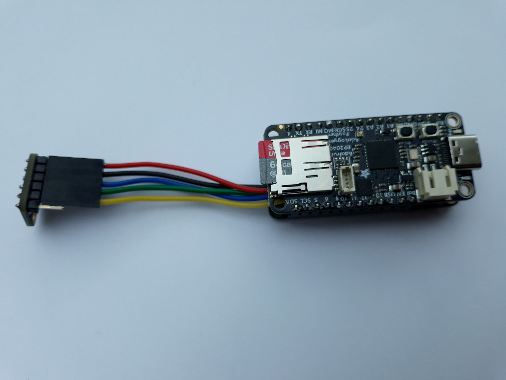
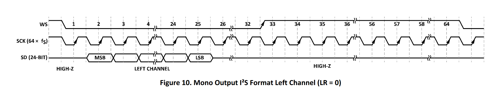

# microPAM
<!-- TOC -->
* [microPAM](#micropam)
  * [Overview](#overview)
  * [I2S Microphone](#i2s-microphone)
  * [Main Loop](#main-loop)
  * [Logger function](#logger-function)
  * [Power consumption](#power-consumption)
  * [Filing latencies](#filing-latencies)
<!-- TOC -->
## Overview
This is a Passive Acoustic Monitor (PAM) using Adafruit PR2040 Adalogger and ICS43434 I2S MEMS microphones.

The basic components are (cost as of 03-Jan-2025)

| Product                 | Adafruit ID | Cost      |
|-------------------------|-------------|-----------|
| RP2040 Adalogger        | ID 5980     | 15.95 US$ |
| DS3231 RTC Featherwing  | ID 3028     | 13.95 US$ |
| ICS43434 I2S Microphone | ID 6049     | 4.95 US$  |
plus micro SD card, RTC coin cell and either 5V Powerbank or 3.7 V Lithium Ion battery 

It uses CircuitPython as basic firmware and a small python script **microPAM.py**. 
The I2S microphone is accessed via a custom PIO module **I2S.py** that controls the I2S bus 
and fetches the MEMS audio data.

## I2S Microphone
The ICS43434 I2S microphone has a special timing as shown here

that needs a special PIO script.

## Main Loop
The mean code of the microPAM logger is a simple loop:

    while True:
        ch=menu()
    
        buffer = i2s.last_read
        if len(buffer) > 0:
            if status != STOPPED:
                logger(buffer)
                data_count += 1
        loop_count += 1

The acquisition is controlled by four states (CLOSED,RUNNING,MUST_STOP, STOPPED). 
If CLOSED a call to logger(buffer) opens a new file and transitions the status to RECORDING.
While recording the data are written to disk, and the time is checked if closing is required. 
If this is the case, the file is closed and status set to CLOSED. 
In case user requested to stop the acquisition, status is set to STOPPED.
 
A simple User Interface (UI) allows to flag the acquisition to start or  to stop.  
Starting the acquisition is done by setting the status to CLOSED (User input 's'<cs>)
Stopping the acquisition is done by setting the status to MUST_STOP (User input 'e'<cr>).
To keep system as simple as possible, no more user interaction is implemented.
After checking if there are new data available and if the acquisition is not stopped, data are saved to disk.

While opening a file, the LED light up to indicate disk activity.

## Logger function
The **logger(buffer)** function handles  all disk related operation, like file name creation, file opening, writing 
and closing.

## Power consumption
Running the RP2040 at 96 MHz the overall consumption is about 250 mW. 

## Filing latencies
Opening of new files on disk, requires the file system (FS) to scan the directory for existing files. 
This will need some time that is proportional to the existing file entries. 
Actually, about 0.3 ms/file is required at a MCU speed of 96 MHz.

To keep this latency in limits 2 levels of directories are implemented. 
Top level daily entry, 2nd level individual hours holding all the files in this hour.
Recording 1 minute files, there will be 60 entries and the maximal time to open a new file will be 18 ms.

The data are stored as 32 bit Wav files, whereby the WAV header is extended to 512 bytes by using a JUNK chunk, 
to facilitate microSD card access performance.

The filename contains 3-byte UID - date and time.
