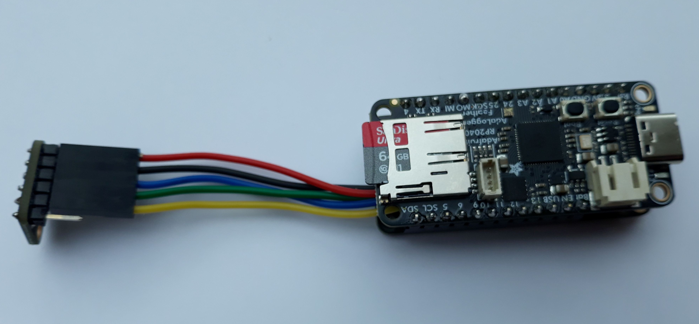

# microPAM
<!-- TOC -->
* [microPAM](#micropam)
  * [Overview](#overview)
  * [I2S Microphone](#i2s-microphone)
  * [Main Loop](#main-loop)
  * [Logger function](#logger-function)
<!-- TOC -->
## Overview
This is a Passive Acoustic Monitor (PAM) using Adafruit PR2040 Adalogger and ICS43434 I2S MEMS microphones.

It uses CircuitPython as basic firmware and a small python script **microPAM.py**. 
The I2S microphone is accessed via a custom PIO module **I2S.py** that controls the I2S bus 
and fetches the MEMS audio data.

## I2S Microphone
The ICS43434 I2S microphone has a special timing as shown here

that needs a special PIO script.

## Main Loop
The mean code of the microPAM logger is a simple loop:

    while True:
        ch=menu()
        if ch==1:
            status=CLOSED
        elif ch==-1:
            status=MUST_STOP
    
        buffer = i2s.last_read
        if len(buffer) > 0:
            if status != STOPPED:
                led.value = True
                logger(buffer)
                led.value = False
                data_count += 1
                if (data_count%100==0): gc.collect()
        loop_count += 1

A simple User Interface (UI) allows to flag the acquisition to start or  to stop. 
To keep system as simple as possible, no more user interaction is implemented.
After checking if there are new data available and if the acquisition is not stopped, data are saved to disk.

While writing to disk, the LED light up to indicate disk activity. Also, the garbage collector is run regularly.

## Logger function
The **logger(buffer)** function handles  all disk related operation, like file name creation, file opening, writing 
and closing.

